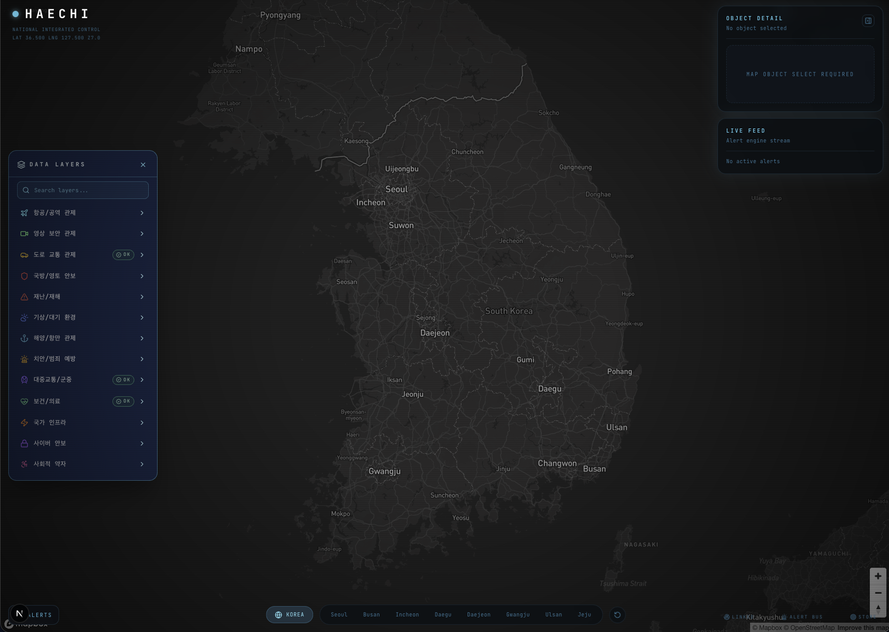
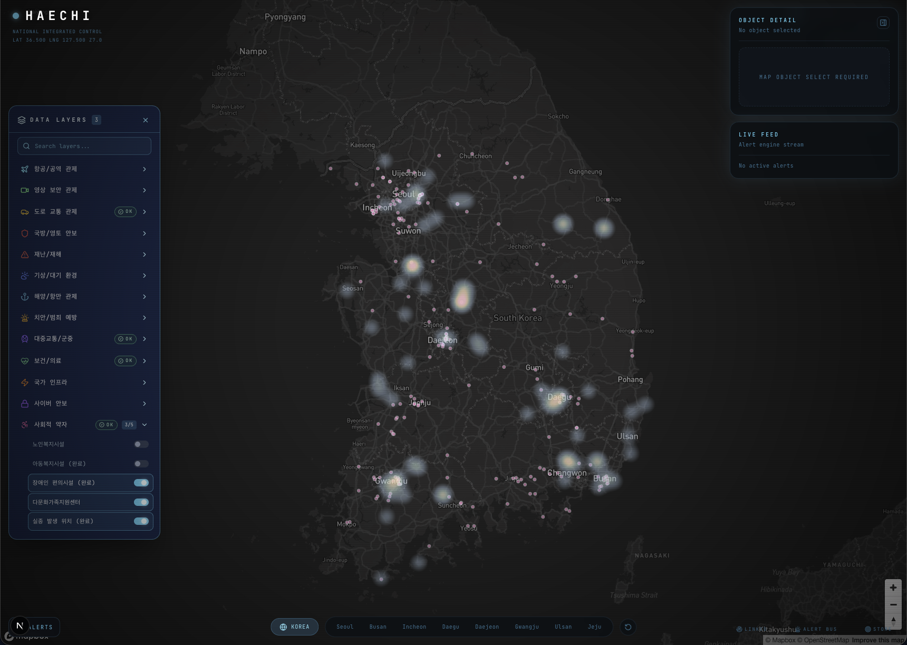

# HAECHI

HAECHI는 공공 안전 데이터를 하나의 지도 위에서 통합 관제하기 위한 상황판 프로젝트입니다.  
항공, CCTV, 해양/항만, 재난, 보건/의료, 사회적 약자, 국가 인프라 등 여러 도메인의 레이어를 하나의 지도 UI에 올리고, 우측 상태 패널과 경보 패널에서 세부 상황을 함께 확인할 수 있도록 구성되어 있습니다.



## 프로젝트 목표

- 여러 공공 API와 좌표 데이터를 하나의 지도 UX로 통합
- 도메인별 레이어를 토글하면서 상황을 빠르게 파악
- 실시간/준실시간 데이터는 서버 라우트에서 정규화 후 지도에 반영
- 상세 패널, 경보 엔진, 데이터 파이프라인 상태를 함께 제공
- 배포 가능한 구조로 점진적으로 mock 데이터를 제거

## 상태 표기 규칙

이 프로젝트에서 상태 표기는 아래 기준으로 해석합니다.

| 표기 | 의미 |
| --- | --- |
| `(완료)` | 현재 런타임에서 upstream 실데이터를 정상 수신 중인 레이어 |
| `미구현 더미데이터` | mock 데이터, 시뮬레이션, 정적 샘플, fallback 응답으로 동작하는 레이어 |
| `정적 참고 레이어` | 실시간 API가 아니라 로컬 GeoJSON/참고 좌표로 유지되는 레이어 |

중요:

- README 기준 운영 원칙은 `레이어 패널에서 upstream source로 판별된 경우만 (완료)` 입니다.
- 일부 예전 레이어명에는 `(완료)` 문자열이 이름 자체에 포함되어 있을 수 있습니다.
- 배포 판단 기준은 하드코딩된 문자열이 아니라 실제 `source === 'upstream'` 상태입니다.



## 현재 구현 현황

### 실데이터 연동 구현 완료

아래 레이어들은 실데이터 연동 코드가 구현되어 있으며, upstream 응답이 정상일 때 UI에서 `(완료)`로 표시됩니다.

- 항공/공역 관제
  - 비행금지구역
- 영상 보안 관제
  - 교통관제 CCTV
- 도로 교통 관제
  - 서울 실시간 돌발정보
- 재난/재해
  - 산불 발생 지점
  - 지진 진앙지 리플
  - 민방위 대피시설
- 해양/항만 관제
  - 울산항 항만시설
  - 울산항 정박지
  - 해상사격훈련구역
  - 해무관측소
  - 항로표지 위치
- 보건/의료
  - 응급실 위치
  - 외상센터
  - 자동심장충격기(AED)
  - 약국 위치
  - 시도별 감염 위험도
  - 기간별 감염 추세
  - 감염병 상세 분포
- 국가 인프라
  - 공공시설물 안전
  - 도로공사 영업소
  - 전기차 충전소
- 기상/대기 환경
  - 대기질 측정소
  - 대기질 열지도
- 사회적 약자
  - 실종 발생 위치
  - 노인복지시설
  - 아동복지시설
  - 장애인 편의시설
  - 다문화가족지원센터

### 미구현 더미데이터 / 시뮬레이션 / fallback

아래 항목은 현재 배포 기준으로 실서비스 데이터가 아니라 mock 또는 시뮬레이션 성격입니다.

- 항공/공역 관제
  - 실시간 항공기
  - 항공기 궤적
  - OpenSky 연동 코드가 있으나, upstream 실패 시 시뮬레이션 fallback으로 동작할 수 있음
- 국방/영토 안보
  - 영공 침범 탐지
  - 현재 시뮬레이션 데이터 기반
- 사이버 안보
  - 사이버 공격 빔
  - 현재 시뮬레이션 데이터 기반
- 공용 Team2 payload fallback
  - 일부 교통/기상/재난/사회적 약자 레이어는 `/api/{domain}` 경로에서 mock payload fallback을 사용할 수 있음
  - 예: VMS 전광표지, 병목 구간, 우회 권고 경로, 강우 집중도, 폭우 경보권, 3D 강수 컬럼, 풍향/풍속 파티클, Amber Alert 이동 반경, 독거노인 IoT 응급 등
- 치안/범죄 예방
  - 현재 실사용 레이어 미연결 상태
  - SafeMap 계열 데이터는 키 등록/업스트림 안정성 문제로 보류 중

### 정적 참고 레이어

아래 항목은 실시간 API보다는 로컬 참고 데이터 성격이 강합니다.

- 군사분계선(MDL) / NLL
- KADIZ 방공식별구역
- 불발탄(UXO) 경고구역

## 아키텍처 개요

### 프론트엔드

- 지도 렌더링: `Mapbox GL JS` + `deck.gl`
- 레이어 토글 및 상태 관리: `Zustand`
- 서버 데이터 캐시/폴링: `TanStack Query`
- UI 구성: `Next.js App Router` + `React 19`
- 애니메이션: `motion`

### 서버/API

- `app/api/*` 경로에서 외부 공공 API 호출
- 외부 응답을 GeoJSON 또는 내부 공통 payload 형태로 정규화
- 일부 도메인은 upstream 실패 시 mock fallback 지원
- 일부 라우트는 MongoDB 기반 저장/캐시 데이터 활용

### 주요 진입점

- 지도 화면: `app/page.tsx`
- 기본 레이어 등록: `components/boot/LayerBootstrap.tsx`
- Team2 공용 도메인 payload 동기화: `components/data/Team2LayerBootstrap.tsx`
- 레이어 정의: `hooks/useDomainLayers.ts`
- 지도 렌더링: `components/map/MapCanvas.tsx`
- 상태 패널: `components/panels/StatusPanel.tsx`
- 레이어 패널: `components/panels/LayerPanel.tsx`

## 기술 스택

- Framework: Next.js 15
- UI: React 19
- Language: TypeScript
- Map Rendering: Mapbox GL JS, deck.gl
- State Management: Zustand
- Data Fetching / Polling: TanStack Query
- Styling: Tailwind CSS 4
- Motion: motion
- Database / Cache Source: MongoDB
- External Data Sources:
  - data.go.kr
  - 서울 열린데이터광장
  - UTIC CCTV Open API
  - OpenSky
  - Safe182
  - VWorld / 디지털트윈 계열 API

## 실행 방법

### 1. 환경 변수 준비

민감 정보는 `.env.local`에 두고, 배포 환경에서는 플랫폼 secret manager를 사용합니다.

```bash
cp .env.example .env.local
```

필요한 키만 채워도 되지만, 레이어별로 사용하는 API 키가 다르므로 실제로 활성화할 레이어에 맞는 값을 넣어야 합니다.

### 2. 의존성 설치

```bash
npm install
```

### 3. 개발 서버 실행

```bash
npm run dev
```

기본 포트는 `3120`입니다.

### 4. 검증

```bash
npm run lint
npm run build
```

### 5. 진행 상태 확인

```bash
npm run phase3:status
```

## 환경 변수 운영 원칙

- `.env.local`은 git에 포함하지 않습니다.
- `.env.example`에는 placeholder만 유지합니다.
- 사용하지 않는 키는 제거합니다.
- 여러 레이어가 같은 키를 공유하는 경우, 배포 전 서비스 단위로 분리하는 것이 좋습니다.
- `NEXT_PUBLIC_*` 변수는 브라우저로 노출되므로 공개 가능한 값만 넣어야 합니다.

## 배포 전 체크 포인트

- mock fallback으로만 보이는 레이어를 배포 대상에서 제외하거나 숨김 처리
- 레이어 이름에 남아 있는 레거시 `(완료)` 문자열 정리
- 외부 API quota, timeout, fallback 정책 재검토
- MongoDB 연결 정보와 외부 API 키를 배포 환경 secret으로 이전
- 실제 운영에 사용하지 않는 API/환경변수/샘플 데이터를 지속적으로 제거

## 앞으로의 방향

1. mock/simulation 레이어를 실데이터 기반 레이어로 교체
2. 치안/범죄 예방 도메인의 안정적인 대체 데이터 소스 확보
3. 레이어별 source 상태를 UI에서 더 명확히 표시
4. 데이터 파이프라인 에러, 응답 지연, quota 초과에 대한 운영 모니터링 강화
5. 배포 기준에서 불필요한 레이어, 샘플 데이터, 미사용 환경변수 지속 제거

## 문서 해석 가이드

이 README는 "현재 코드 기준" 문서입니다.

- UI에서 `(완료)`가 붙는 항목은 실시간 또는 실데이터 upstream을 실제로 받아오고 있는 상태를 의미합니다.
- 더미데이터를 사용 중이라면 배포 준비 관점에서는 아직 `미구현 더미데이터`로 봅니다.
- 따라서 레이어가 화면에 보인다는 이유만으로 배포 가능 상태라고 판단하지 않습니다.
